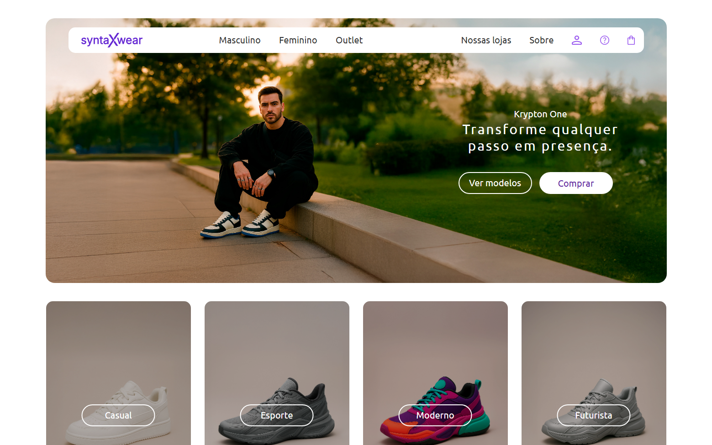

# 🛍️ SyntaxWear — E-commerce Frontend

    

Uma interface de **e-commerce de roupas streetwear**, desenvolvida com foco em layout moderno, organização de produtos e experiência visual do usuário.

Este projeto simula a página inicial de uma loja virtual chamada **SyntaxWear**, com seções de produtos, destaques e navegação estilizada.

---

## 🧠 Sobre o Projeto

O **SyntaxWear** é um projeto frontend que representa a estrutura visual de um e-commerce de moda.

O objetivo foi praticar:

- Estruturação semântica com HTML
- Estilização moderna com CSS
- Organização de layout responsivo
- Construção de interface inspirada em lojas reais

---

## 🚀 Funcionalidades

- 🏷️ Exibição de produtos em destaque  
- 🛒 Layout estilo loja virtual  
- 🎨 Design moderno e organizado  
- 📱 Estrutura preparada para responsividade  
- 🖼️ Uso de imagens para simular catálogo real  

---

## 🛠️ Tecnologias Utilizadas

- **HTML5** – Estrutura da página  
- **CSS3** – Estilização e layout   

---